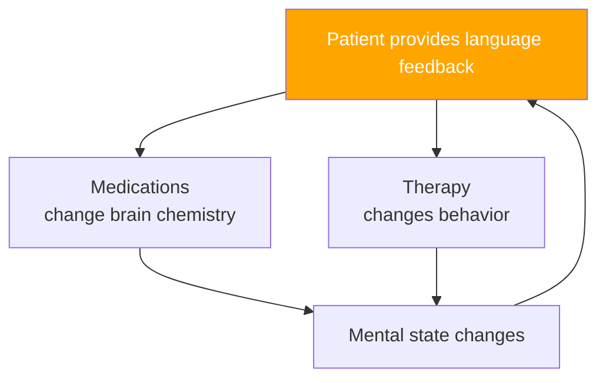
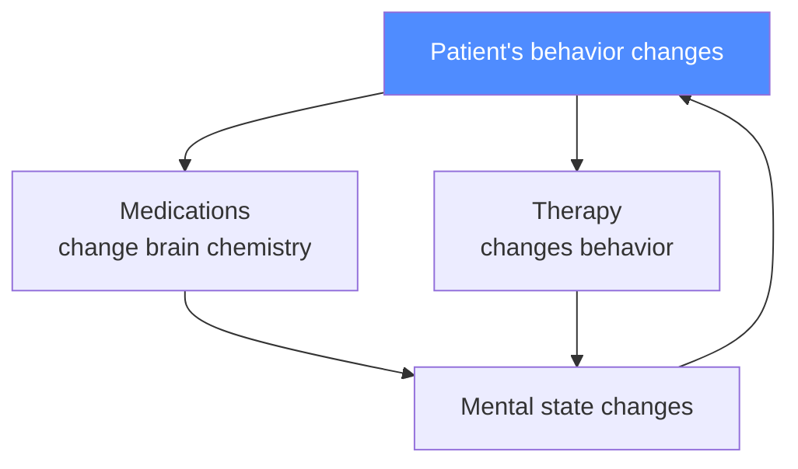
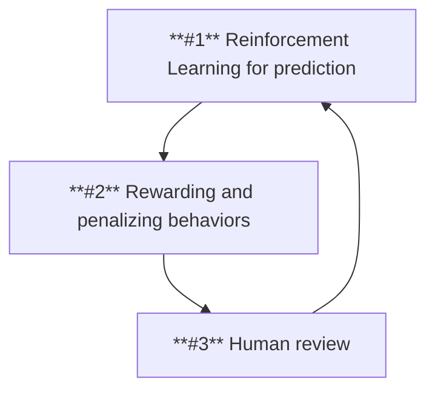

---
layout: intro
transition: slide-down
---

::title::

## Theoretical Framework

::content::

The current work is designed to serve as a theoretical basis for my planned PhD research.

This framework is necessary because we work with **real** children and adolescents, so we must be as careful as possible **to avoid causing them any harm**.

---
layout: section
image: https://images.unsplash.com/photo-1550684848-fac1c5b4e853?q=80&w=1920&auto=format&fit=crop&ixlib=rb-4.1.0&ixid=M3wxMjA3fDB8MHxwaG90by1wYWdlfHx8fGVufDB8fHx8fA%3D%3D
---

::title::

# Psychiatry Introduction

---
layout: default
---

::title::

## How can we describe psychiatry?

::content::

Psychiatry is a branch of medical science and practice focused on improving the mental condition of an individual (or an entire population), based on:

- The experience of medical and psychological professionals  
  *(easiest to adopt, hardest to reproduce)*  
  **Example:** Sigmund Freud's work

- Empirical scientific models  
  *(the majority; preferred by Evidence-Based Medicine/Psychology)*  
  **Example:** Classical (Pavlov's) or operant (Skinner's) conditioning

- Formal scientific models  
  *(very narrow adoption so far, but already proven in some cases)*  
  **Example:** Hodgkin and Huxley model (cell membrane as an RC circuit)

---
layout: image-right
image: https://cdn.britannica.com/23/242523-050-63DCE08D/skinner-box-operant-conditioning-chamber.jpg
---

::title::

## Skinner's Operant Conditioning Box

::content::

Skinner's box demonstrates operant conditioning, where behaviors (e.g., lever pressing) are shaped through rewards or punishments. This concept is foundational for modern behavioral therapies.

---
layout: image-left
image: https://www.researchgate.net/publication/343552664/figure/fig3/AS:1022318641954817@1620751166120/Hodgkin-Huxley-model-of-biological-neurons-that-describes-in-detail-the.png
---

::title::

## Hodgkin-Huxley RC Cell Membrane Model

::content::

The Hodgkin-Huxley model represents the neuron's membrane as an electrical circuit (RC circuit), where ion channels act as resistors and the membrane functions as a capacitor. This framework explains how action potentials are generated and propagated, and forms the basis of modern neurophysiology.

---
layout: default
transition: slide-down
---

::title::

## Natural Language *in the loop*

::content::

---
layout: section
image: https://images.unsplash.com/photo-1550684848-fac1c5b4e853?q=80&w=1920&auto=format&fit=crop&ixlib=rb-4.1.0&ixid=M3wxMjA3fDB8MHxwaG90by1wYWdlfHx8fGVufDB8fHx8fA%3D%3D

---

::title::

# Autism Preliminary

---
layout: default
---

::title::

## How can we describe autism?

::content::

Autism is a neurodevelopmental disorder with unknown cause and heterogeneous traits, particularly:
- Difficulties in social interactions
- Repetitive, restrictive behaviors
- Insistence on sameness
- Fixations or intense interests
- Sudden-onset violent outbursts or tantrums
- Difficulties in verbal communication at varying levels

---
layout: fact
---

::title::

## Even 1/3...

::content::

### ...of autistic individuals are minimally verbal or strictly non-verbal!

---
layout: full
image: /images/tantrum.gif
contentClass: text-white
transition: slide-down
---

::content::

## Tantrum Concept

---
layout: section
image: https://images.unsplash.com/photo-1550684848-fac1c5b4e853?q=80&w=1920&auto=format&fit=crop&ixlib=rb-4.1.0&ixid=M3wxMjA3fDB8MHxwaG90by1wYWdlfHx8fGVufDB8fHx8fA%3D%3D

---

::title::

# Framework Overview

---
layout: two-cols
---

::left-title::

## Existing Solutions

::left-content::

- ASRS – Autism Spectrum Rating Scales
- ADOS-2 – Autism Diagnostic Observation Schedule, 2nd Edition
- ADI-R – Autism Diagnostic Interview–Revised
- Biofeedback EEG therapy
- Sensory integration therapy
- Neurologopedic therapy
- Typical *spoken* psychotherapy
- Psychotropic medications to reduce aggression and anxiety

::right-title::

## Their Limitations

::right-content::

- **Almost every tool requires some level of verbal interaction!**
- Medications are often prescribed using a *trial-and-error* approach
- Speech development is perceived as *all-or-nothing* for future prognosis
- Each procedure requires experienced and certified personnel

---
layout: default
---

::title::

## Patient's Behavior *in the loop*

::content::

---
layout: two-cols-header
---

::header::

## Digital Twin Concept

::left-title::

### Observation and Prediction

::left-content::

- Observe patients
- Map their behavior using motion capture
- Classification and prediction
- Observations tied to the individual’s timeline

::right-title::

### Simulation

::right-content::

- Reproduction of observed behaviors
- Rewarding **typical** autistic traits
- Penalizing *sensory overload*
- Simulation **without** direct observation
- Extending the timeline using computational resources

---
layout: default
---

::title::

## Proposed Predictive Workflow

::content::

---
layout: default
---

::title::

## Planned Study Phases

::content::

1. Observation of selected patients from psychiatric practice
2. Capture of their behavior and mapping it onto a virtual environment
3. Simulation of artificial individual behavior in the same environment
4. Qualitative studies — inspired by the Rosenhan experiment (experts review both captured and simulated individuals inside the virtual environment)
5. Quantitative studies — **autism spectrum** measurement of artificial individuals

**Research goal:**

Ability to simulate autistic behavior in a given virtual environment.

---
layout: default
transition: slide-down
---

::title::

## Future Perspectives

::content::

1. Creating diagnostic tools using VR/XR
2. Developing novel therapies
3. Robotic assistants for autistic individuals
4. Discovering new methods—beyond spoken language—to communicate with non-verbal autistic individuals

---
layout: section
image: https://images.unsplash.com/photo-1550684848-fac1c5b4e853?q=80&w=1920&auto=format&fit=crop&ixlib=rb-4.1.0&ixid=M3wxMjA3fDB8MHxwaG90by1wYWdlfHx8fGVufDB8fHx8fA%3D%3D

---

::title::

# Our Hopes

---
layout: full
image: https://i.ytimg.com/vi/ahOIJNLLtkI/maxresdefault.jpg
contentClass: text-white
---

::content::

## GTA (1997)

---
layout: full
image: https://staticg.sportskeeda.com/editor/2024/10/4b20d-17300204572825-1920.jpg
contentClass: text-white
---

::content::

## GTA 2 (1999)

---
layout: full
image: https://i.blogs.es/a4deb1/gta-3-2510069/1366_2000.jpeg
contentClass: text-white
---

::content::

## GTA 3 (2001)

---
layout: full
image: https://platform.polygon.com/wp-content/uploads/sites/2/chorus/uploads/chorus_asset/file/24581544/GTA_Vice_City_cheats_guide_2.jpg?quality=90&strip=all&crop=0,0,100,100
contentClass: text-white
---

::content::

## GTA Vice City (2002)

---
layout: full
image: https://sm.ign.com/ign_es/screenshot/default/gta-san-andreas-secretos-easter-eggs-mitos_e47x.jpg
contentClass: text-white
---

::content::

## GTA San Andreas (2004)

---
layout: full
image:  https://larepublica.cronosmedia.glr.pe/original/2021/04/06/606bcd305ad9186ab25f9cff.jpg
contentClass: text-white
---

::content::

## GTA 4 (2008)

---
layout: full
image: https://cdn.hobbyconsolas.com/sites/navi.axelspringer.es/public/media/image/2014/09/382006-gta-v-fecha-lanzamiento-ps4-xbox-one-pc-confirmada.jpg?tf=3840x
contentClass: text-white
---

::content::

## GTA 5 (2013)

---
layout: full
image: https://www.gamespot.com/a/uploads/original/1179/11799911/4489449-screenshot2025-05-06at10.38.24am.png
contentClass: text-white
---

::content::

## GTA 6 (2026)

---
layout: full
image: https://developer-blogs.nvidia.com/wp-content/uploads/2025/03/zorah-sample-still-courtyard-shade-1024x577.png
contentClass: text-white
---

::content::

## Nvidia Zorah (2025)

---
layout: full
image: https://developer-blogs.nvidia.com/wp-content/uploads/2025/03/nvidia-isaac-gr00t-n1-featured.gif
contentClass: text-white
---

::content::

## Isaac GR00T N1 (2025)

---
layout: default
---

::title::

# Summary

::content::

We know our plan is ambitious.

It is better to aim high and fail than to remain in a safe comfort zone.

Worst-case scenario: Even if this project fails completely, we do not risk children's mental health -- because simulations come first, before any real treatment.

If we achieve some success, we have the potential to improve the quality of life for one-third of autistic individuals, support their parents, and reduce social costs.

---
layout: quote
image: https://www.biografiasyvidas.com/biografia/k/fotos/korzybski.jpg
---

::author::

**Alfred Korzybski**, Polish-American independent scholar

::content::

### The map is not the territory...

---
layout: end
email: dominik@mukrecki.pl
image: https://images.unsplash.com/photo-1550684848-fac1c5b4e853?q=80&w=1920&auto=format&fit=crop&ixlib=rb-4.1.0&ixid=M3wxMjA3fDB8MHxwaG90by1wYWdlfHx8fGVufDB8fHx8fA%3D%3D
---

::content::

# Thank You

It was a pleasure to present my topic to the PhD Colloquium audience.

I hope to see you next year and to be able to show you work in progress.