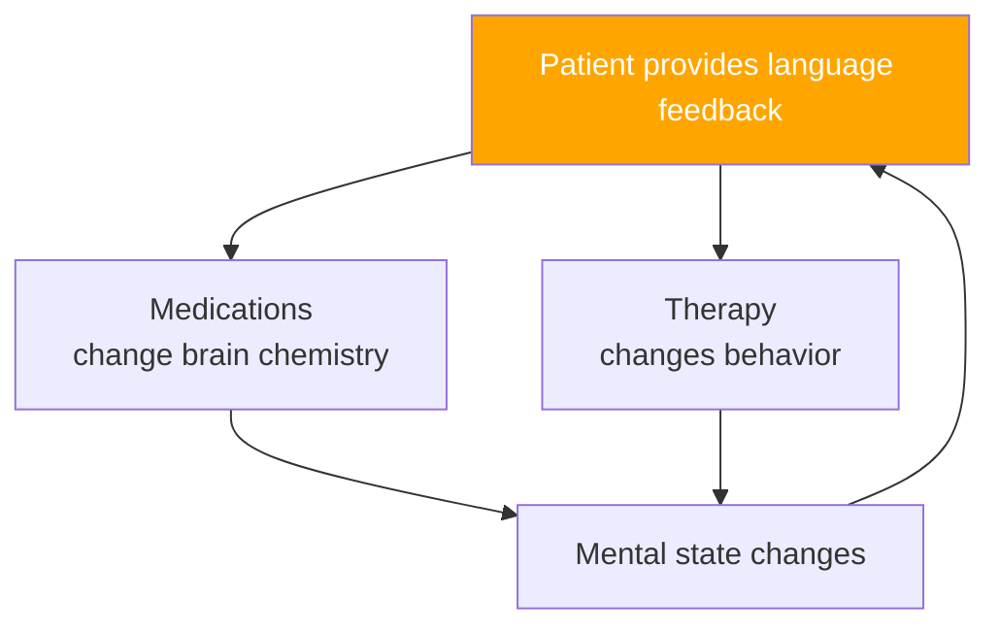
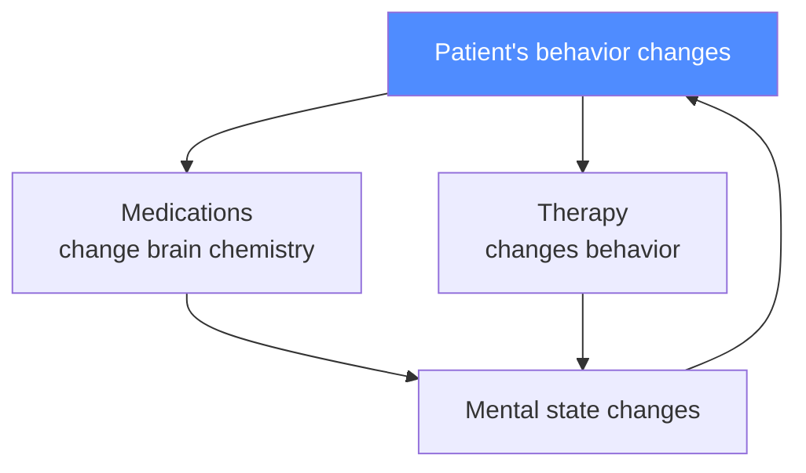
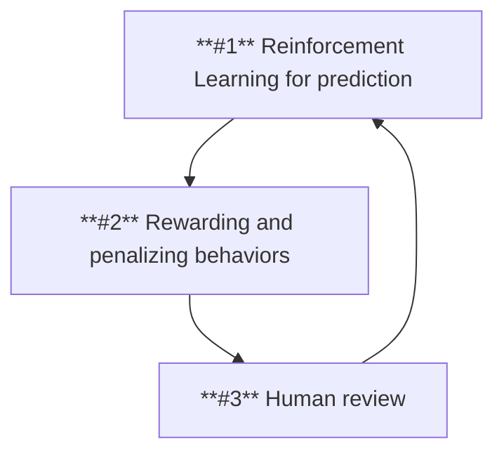

---
layout: intro
---

::title::

# Theoretical framework

::content::

Current work is designed to serve as a theoretical basis for planned PhD research.

The need for framework is driven by perspective of working with **real** childrens and adolescents, so we have to be as carefull as possible **to do not harm them**.

---
layout: section
---

::title::

# Psychiatry Introduction

---
layout: default
---

::title::

## How can we describe the psychiatry?

::content::

Medical science and medical practice designed to improve mental condition of particular person (or whole population) based on:

- Experience of the medical and psychological professionals (easiest to adopt, hardest to reproduce)

**Example:** Sigmund Freud's work

- Empirical scientific models (majority, preffered by Evidence Based Medicine/Psychology)

**Example:** Classical (Pavlov's) or operand (Skinner's) conditioning

- Formal scientific models (very narrow adoption field, but already proven)

**Example:** Hodgkin and Huxley model (cell membrane as a RC circuit)

---
layout: image-right
image: https://cdn.britannica.com/23/242523-050-63DCE08D/skinner-box-operant-conditioning-chamber.jpg
---

::title::

## Skinner's Operant Conditioning Box

::content::

Skinner's box demonstrates operant conditioning, where behaviors (e.g., lever pressing) are shaped through rewards or punishments, foundational for modern behavioral therapies.

---
level: 2
layout: image-left
image: https://www.researchgate.net/publication/343552664/figure/fig3/AS:1022318641954817@1620751166120/Hodgkin-Huxley-model-of-biological-neurons-that-describes-in-detail-the.png
---

::title::

## Hodgkin-Huxley RC Cell Membrane Model

::content::

The Hodgkin-Huxley model represents the neuron's membrane as an electrical circuit (RC circuit), where ion channels act as resistors and the membrane as a capacitor. This framework explains how action potentials are generated and propagated, forming the basis of modern neurophysiology.

---
layout: default
---

::title::

## Natural language *in the loop*

::content::

---
layout: section
---

::title::

# Autism Preliminary

---
layout: default
---

::title::

## How can we describe the autism?

::content::

Neurodevelopmental disorder with unknown cause and heterogenous traits -- particularly:
- dificculties in social interacitons
- repetitive, restrictive behaviours
- insistince on sameness
- fixations
- sudden-onset violent outbursts, tantrums
- difficulties in verbal communication at varies level

---
layout: fact
---

::title::

## Even 1/3...

::content::

### ...of autistic individuals are minimally verbal or strictly non-verbal!

---
layout: full
image: /images/tantrum.gif
contentClass: text-white
---

::content::

## Tantrum concept

---
layout: section
---

::title::

# Framework overwiev

---
layout: two-cols
---

::left-title::

## Existing solutions

::left-content::

- ASRS -- Autism Spectrum Rating Scales
- ADOS-2 -- Autism Diagnostic Observation Schedule, 2nd Edition
- ADI-R -- Autism Diagnostic Interview – Revised
- Biofeedback EEG therapy
- Sensory integration therapy
- Neurologopedic therapy
- Typical *spoken* psychotherapy
- Psychotropic medications to reduce agression and anxiety

::right-title::

## Their limitations

::right-content::

- **Almost each tool needs some level of verbal interaction!**
- Medications are prescribed practically using *trials and errors* method
- Speech development is percived as *all-or-nothing* for prognosis of future development
- Each procedure needs experienced and certified personnel

---
layout: default
---

::title::

## Patient's behavior in the loop

::content::

---
layout: two-cols-header
---

::header::

## Digital Twin Concept

::left-title::

### Observation and prediction

::left-content::

- Observe patients
- Try to map their behavior using motion capture
- Classification and prediction
- Observation bound to individual timelapse

::right-title::

### Simmulation

::right-content::

- Reproduction of observed behavior
- Rewarding **typical** autistic traits
- Penalizing *sensory overload*
- Simmulation **without** observation
- Augmentation of timelapse using computational resources

---
layout: default
---

::title::

## Proposed predictive workflow

::content::

---
layout: default
---

::title::

## Planned study phases

::content::

1. Observations of selected patients selected from psychiatric practice
2. Capture of their behavior and mapping it onto virtual environment
3. Simulation of artificial individual behavior in the same enviroment
4. Qualitative studies -- inspired by Rosenhan experiment (experts review of both: captured and simulated individuals inside virtual environment)
5. Quantitative studies -- **autism spectrum** measurement of artificial individuals

**Research goal:**

Ability to simulate autistic behavior in the given virtual environment.

---
layout: default
level: 2
---

::title::

## Future Perspectives

::content::

1. Creating diagnostic tools using VR/XR
2. Developing novel therapies
3. Robotic assistants for autistic individuals
4. Discovering other than spoken language method to communicate with non-verbal autistic individuals

---
layout: section
---

::title::

# Our Hopes

---
layout: full
image: https://i.ytimg.com/vi/ahOIJNLLtkI/maxresdefault.jpg
contentClass: text-white
---

::content::

## GTA (1997)

---
layout: full
image: https://staticg.sportskeeda.com/editor/2024/10/4b20d-17300204572825-1920.jpg
contentClass: text-white
---

::content::

## GTA 2 (1999)

---
layout: full
image: https://i.blogs.es/a4deb1/gta-3-2510069/1366_2000.jpeg
contentClass: text-white
---

::content::

## GTA 3 (2001)

---
layout: full
image: https://platform.polygon.com/wp-content/uploads/sites/2/chorus/uploads/chorus_asset/file/24581544/GTA_Vice_City_cheats_guide_2.jpg?quality=90&strip=all&crop=0,0,100,100
contentClass: text-white
---

::content::

## GTA Vice City (2002)

---
layout: full
image: https://sm.ign.com/ign_es/screenshot/default/gta-san-andreas-secretos-easter-eggs-mitos_e47x.jpg
contentClass: text-white
---

::content::

## GTA San Andreas (2004)

---
layout: full
image:  https://larepublica.cronosmedia.glr.pe/original/2021/04/06/606bcd305ad9186ab25f9cff.jpg
contentClass: text-white
---

::content::

## GTA 4 (2008)

---
layout: full
image: https://cdn.hobbyconsolas.com/sites/navi.axelspringer.es/public/media/image/2014/09/382006-gta-v-fecha-lanzamiento-ps4-xbox-one-pc-confirmada.jpg?tf=3840x
contentClass: text-white
---

::content::

## GTA 5 (2013)

---
layout: full
image: https://www.gamespot.com/a/uploads/original/1179/11799911/4489449-screenshot2025-05-06at10.38.24am.png
contentClass: text-white
---

::content::

## GTA 6 (2026)

---
layout: full
image: https://developer-blogs.nvidia.com/wp-content/uploads/2025/03/zorah-sample-still-courtyard-shade-1024x577.png
contentClass: text-white
---

::content::

## Nvidia Zorah (2025)

---
level: 2
layout: full
image: https://developer-blogs.nvidia.com/wp-content/uploads/2025/03/nvidia-isaac-gr00t-n1-featured.gif
contentClass: text-white
---

::content::

## Isaac GR00T N1 (2025)

---
layout: end
email: dominik@mukrecki.pl
contentClass: text-white
---

::content::

# Thank You

It was a pleasure to present my topic to the PhD Colloquim audience.

I am hoping that we will see in the next year and will be able to show you work in progress.